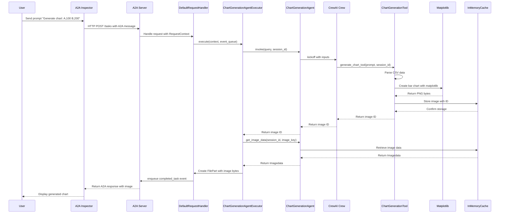

# A2A + CrewAI + OpenRouter Chart Generation Agent Tutorial

## Tutorial Focus

This tutorial will guide you through practicing the following core skills:

- **Integrating OpenRouter + CrewAI + A2A**: Complete end-to-end Agent development using OpenRouter as LLM provider, CrewAI as Agent framework, and A2A protocol as standardized interface
- **Practicing A2A Agent Image Data Return**: Learn how to make Agents generate and return image data, not just text responses
- **Using [A2A Inspector](https://a2aprotocol.ai/blog/a2a-inspector) to Debug A2A Applications**: Master professional debugging tools to test and validate your Agent applications

## Quick Start

### 1. Clone the Code

```bash
git clone git@github.com:sing1ee/a2a-crewai-charts-agent.git
cd a2a-crewai-charts-agent
```

### 2. Create Environment Configuration

Create `.env` file:

```bash
OPENROUTER_API_KEY=sk-or-v1-your-api-key-here
OPENAI_MODEL_NAME=openrouter/anthropic/claude-3.7-sonnet
```

### 3. Environment Setup and Run

```bash
# Create virtual environment
uv venv

# Activate virtual environment
source .venv/bin/activate

# Run application
uv run .
```

The application will start at `http://localhost:10011`.

## Debug with A2A Inspector

[A2A Inspector](https://a2aprotocol.ai/blog/a2a-inspector) is a powerful tool specifically designed for debugging A2A applications.

### Debugging Steps:

1. **Access A2A Inspector**: Open [https://inspector.a2aprotocol.ai](https://inspector.a2aprotocol.ai)

2. **Connect to Your Agent**:
   - Enter your Agent address in Inspector: `http://localhost:10011`
   - Click "Connect" to establish connection

3. **Test Agent Functionality**:
   - Send test message: `"Generate a chart of revenue: Jan,1000 Feb,2000 Mar,1500"`
   - Observe the complete A2A protocol interaction process
   - View returned image data

4. **Debug and Monitor**:
   - Check Agent's capabilities and skills
   - Monitor complete request and response flow
   - Verify correct image data transmission

Refer to [A2A Inspector Documentation](https://a2aprotocol.ai/blog/a2a-inspector) for more detailed debugging guides.

## Main Process and Code Introduction

### System Architecture Sequence Diagram



### Core Component Details

#### 1. A2A Server Initialization (`__main__.py`)

```python
# Define Agent capabilities and skills
capabilities = AgentCapabilities(streaming=False)
skill = AgentSkill(
    id='chart_generator',
    name='Chart Generator',
    description='Generate a chart based on CSV-like data passed in',
    tags=['generate image', 'edit image'],
    examples=['Generate a chart of revenue: Jan,$1000 Feb,$2000 Mar,$1500'],
)

# Create Agent card
agent_card = AgentCard(
    name='Chart Generator Agent',
    description='Generate charts from structured CSV-like data input.',
    url=f'http://{host}:{port}/',
    version='1.0.0',
    defaultInputModes=ChartGenerationAgent.SUPPORTED_CONTENT_TYPES,
    defaultOutputModes=ChartGenerationAgent.SUPPORTED_CONTENT_TYPES,
    capabilities=capabilities,
    skills=[skill],
)
```

**Key Points**:
- `AgentCapabilities` defines supported Agent functions (streaming disabled here)
- `AgentSkill` describes specific Agent skills and usage examples
- `AgentCard` is the Agent's identity in A2A protocol

#### 2. CrewAI Agent Implementation (`agent.py`)

```python
class ChartGenerationAgent:
    def __init__(self):
        # Create specialized chart generation Agent
        self.chart_creator_agent = Agent(
            role='Chart Creation Expert',
            goal='Generate a bar chart image based on structured CSV input.',
            backstory='You are a data visualization expert who transforms structured data into visual charts.',
            verbose=False,
            allow_delegation=False,
            tools=[generate_chart_tool],
        )

        # Define task
        self.chart_creation_task = Task(
            description=(
                "You are given a prompt: '{user_prompt}'.\n"
                "If the prompt includes comma-separated key:value pairs (e.g. 'a:100, b:200'), "
                "reformat it into CSV with header 'Category,Value'.\n"
                "Ensure it becomes two-column CSV, then pass that to the 'ChartGenerationTool'.\n"
                "Use session ID: '{session_id}' when calling the tool."
            ),
            expected_output='The id of the generated chart image',
            agent=self.chart_creator_agent,
        )
```

**Key Points**:
- CrewAI's `Agent` class defines AI assistant roles and capabilities
- `Task` class describes specific task execution logic
- Custom tools are integrated into Agent through `tools` parameter

#### 3. Chart Generation Tool

```python
@tool('ChartGenerationTool')
def generate_chart_tool(prompt: str, session_id: str) -> str:
    """Generates a bar chart image from CSV-like input using matplotlib."""
    
    # Parse CSV data
    df = pd.read_csv(StringIO(prompt))
    df.columns = ['Category', 'Value']
    df['Value'] = pd.to_numeric(df['Value'], errors='coerce')
    
    # Generate bar chart
    fig, ax = plt.subplots()
    ax.bar(df['Category'], df['Value'])
    ax.set_xlabel('Category')
    ax.set_ylabel('Value')
    ax.set_title('Bar Chart')
    
    # Save as PNG bytes
    buf = BytesIO()
    plt.savefig(buf, format='png')
    plt.close(fig)
    buf.seek(0)
    image_bytes = buf.read()
    
    # Encode and cache image
    data = Imagedata(
        bytes=base64.b64encode(image_bytes).decode('utf-8'),
        mime_type='image/png',
        name='generated_chart.png',
        id=uuid4().hex,
    )
    
    # Store image in cache
    session_data = cache.get(session_id) or {}
    session_data[data.id] = data
    cache.set(session_id, session_data)
    
    return data.id
```

**Key Points**:
- Use `@tool` decorator to convert function into CrewAI tool
- Use pandas to parse CSV data, matplotlib to generate charts
- Images stored as base64 encoding for network transmission
- Use session IDs to manage data isolation for multiple users

#### 4. A2A Executor (`agent_executor.py`)

```python
class ChartGenerationAgentExecutor(AgentExecutor):
    async def execute(self, context: RequestContext, event_queue: EventQueue) -> None:
        # Get user input
        query = context.get_user_input()
        
        # Call CrewAI Agent
        result = self.agent.invoke(query, context.context_id)
        
        # Get generated image data
        data = self.agent.get_image_data(
            session_id=context.context_id, 
            image_key=result.raw
        )
        
        if data and not data.error:
            # Create file part containing image bytes
            parts = [
                Part(
                    root=FilePart(
                        file=FileWithBytes(
                            bytes=data.bytes,
                            mimeType=data.mime_type,
                            name=data.name,
                        )
                    )
                )
            ]
        else:
            # Return text message in error case
            parts = [Part(root=TextPart(text=data.error or 'Failed to generate chart image.'))]
        
        # Add completed task to event queue
        event_queue.enqueue_event(
            completed_task(
                context.task_id,
                context.context_id,
                [new_artifact(parts, f'chart_{context.task_id}')],
                [context.message],
            )
        )
```

**Key Points**:
- `AgentExecutor` is A2A protocol execution layer
- Get user requests through `RequestContext`
- Convert CrewAI responses to A2A protocol format
- Support returning file-type data (images)

#### 5. Cache System (`utils.py`)

```python
class InMemoryCache:
    """Simple thread-safe in-memory cache with no expiration."""
    
    def __init__(self):
        self._lock = threading.Lock()
        self._store: dict[str, Any] = {}
    
    def get(self, key: str) -> Any | None:
        with self._lock:
            return self._store.get(key)
    
    def set(self, key: str, value: Any) -> None:
        with self._lock:
            self._store[key] = value
```

**Key Points**:
- Thread-safe in-memory cache implementation
- Used to store generated image data
- Supports session isolation to avoid user data confusion

## Technology Stack Summary

- **A2A Protocol**: Standardized Agent communication protocol
- **CrewAI**: Multi-Agent collaboration framework
- **OpenRouter**: LLM API aggregation service
- **Matplotlib**: Python chart generation library
- **Pandas**: Data processing library
- **UV**: Modern Python package manager

## Extension Suggestions

1. **Support More Chart Types**: Pie charts, line charts, scatter plots, etc.
2. **Add Data Validation**: Stronger input data validation and error handling
3. **Persistent Cache**: Use Redis or file system to store images
4. **Streaming Support**: Support real-time chart generation progress
5. **Multimodal Input**: Support uploading CSV files instead of text-only input

Through this tutorial, you have mastered the core skills of building practical Agents using modern AI technology stack. This chart generation Agent can serve as the foundation for more complex data analysis applications.