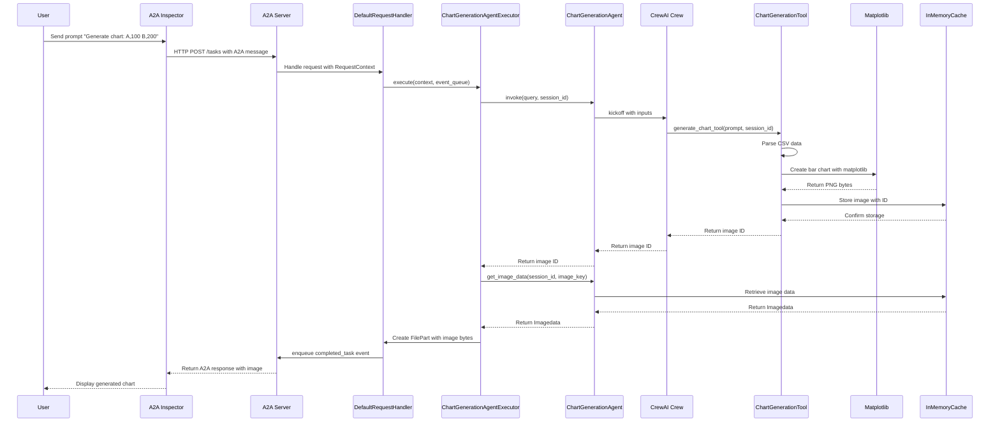

# A2A + CrewAI + OpenRouter 图表生成 Agent 教程

## 教程重点

本教程将指导您完成以下核心技能的实践：

- **集成 OpenRouter + CrewAI + A2A**：完成端到端的 Agent 开发，使用 OpenRouter 作为 LLM 提供商，CrewAI 作为 Agent 框架，A2A 协议作为标准化接口
- **实践 A2A Agent 返回 Image Data**：学习如何让 Agent 生成并返回图像数据，而不仅仅是文本回复
- **使用 [A2A Inspector](https://a2aprotocol.ai/blog/a2a-inspector) 调试 A2A 应用**：掌握专业的调试工具来测试和验证您的 Agent 应用

## 快速开始

### 1. 克隆代码

```bash
git clone git@github.com:a2aproject/a2a-samples.git
cd a2a-samples/samples/python/agents/analytics
```

### 2. 创建环境配置

创建 `.env` 文件：

```bash
OPENROUTER_API_KEY=sk-or-v1-your-api-key-here
OPENAI_MODEL_NAME=openrouter/anthropic/claude-3.7-sonnet
```

### 3. 环境设置和运行

```bash
# 创建虚拟环境
uv venv

# 激活虚拟环境
source .venv/bin/activate

# 运行应用
uv run .
```

应用将在 `http://localhost:10011` 启动。

## 使用 A2A Inspector 调试

[A2A Inspector](https://a2aprotocol.ai/blog/a2a-inspector) 是专门为调试 A2A 应用设计的强大工具。

### 调试步骤：

1. **访问 A2A Inspector**：打开 [https://inspector.a2aprotocol.ai](https://inspector.a2aprotocol.ai)

2. **连接到您的 Agent**：
   - 在 Inspector 中输入您的 Agent 地址：`http://localhost:10011`
   - 点击 "Connect" 建立连接

3. **测试 Agent 功能**：
   - 发送测试消息：`"Generate a chart of revenue: Jan,1000 Feb,2000 Mar,1500"`
   - 观察 A2A 协议的完整交互过程
   - 查看返回的图像数据

4. **调试和监控**：
   - 检查 Agent 的 capabilities 和 skills
   - 监控请求和响应的完整流程
   - 验证图像数据的正确传输

参考 [A2A Inspector 文档](https://a2aprotocol.ai/blog/a2a-inspector) 获取更详细的调试指南。

## 主要流程和代码介绍

### 系统架构时序图



### 核心组件详解

#### 1. A2A 服务器初始化 (`__main__.py`)

```python
# 定义 Agent 能力和技能
capabilities = AgentCapabilities(streaming=False)
skill = AgentSkill(
    id='chart_generator',
    name='Chart Generator',
    description='Generate a chart based on CSV-like data passed in',
    tags=['generate image', 'edit image'],
    examples=['Generate a chart of revenue: Jan,$1000 Feb,$2000 Mar,$1500'],
)

# 创建 Agent 卡片
agent_card = AgentCard(
    name='Chart Generator Agent',
    description='Generate charts from structured CSV-like data input.',
    url=f'http://{host}:{port}/',
    version='1.0.0',
    defaultInputModes=ChartGenerationAgent.SUPPORTED_CONTENT_TYPES,
    defaultOutputModes=ChartGenerationAgent.SUPPORTED_CONTENT_TYPES,
    capabilities=capabilities,
    skills=[skill],
)
```

**关键点**：
- `AgentCapabilities` 定义了 Agent 支持的功能（这里禁用了流式传输）
- `AgentSkill` 描述了 Agent 的具体技能和使用示例
- `AgentCard` 是 A2A 协议中 Agent 的身份标识

#### 2. CrewAI Agent 实现 (`agent.py`)

```python
class ChartGenerationAgent:
    def __init__(self):
        # 创建专门的图表生成 Agent
        self.chart_creator_agent = Agent(
            role='Chart Creation Expert',
            goal='Generate a bar chart image based on structured CSV input.',
            backstory='You are a data visualization expert who transforms structured data into visual charts.',
            verbose=False,
            allow_delegation=False,
            tools=[generate_chart_tool],
        )

        # 定义任务
        self.chart_creation_task = Task(
            description=(
                "You are given a prompt: '{user_prompt}'.\n"
                "If the prompt includes comma-separated key:value pairs (e.g. 'a:100, b:200'), "
                "reformat it into CSV with header 'Category,Value'.\n"
                "Ensure it becomes two-column CSV, then pass that to the 'ChartGenerationTool'.\n"
                "Use session ID: '{session_id}' when calling the tool."
            ),
            expected_output='The id of the generated chart image',
            agent=self.chart_creator_agent,
        )
```

**关键点**：
- CrewAI 的 `Agent` 类定义了 AI 助手的角色和能力
- `Task` 类描述了具体的任务执行逻辑
- 通过 `tools` 参数将自定义工具集成到 Agent 中

#### 3. 图表生成工具

```python
@tool('ChartGenerationTool')
def generate_chart_tool(prompt: str, session_id: str) -> str:
    """Generates a bar chart image from CSV-like input using matplotlib."""
    
    # 解析 CSV 数据
    df = pd.read_csv(StringIO(prompt))
    df.columns = ['Category', 'Value']
    df['Value'] = pd.to_numeric(df['Value'], errors='coerce')
    
    # 生成柱状图
    fig, ax = plt.subplots()
    ax.bar(df['Category'], df['Value'])
    ax.set_xlabel('Category')
    ax.set_ylabel('Value')
    ax.set_title('Bar Chart')
    
    # 保存为 PNG 字节
    buf = BytesIO()
    plt.savefig(buf, format='png')
    plt.close(fig)
    buf.seek(0)
    image_bytes = buf.read()
    
    # 编码并缓存图片
    data = Imagedata(
        bytes=base64.b64encode(image_bytes).decode('utf-8'),
        mime_type='image/png',
        name='generated_chart.png',
        id=uuid4().hex,
    )
    
    # 将图片存储到缓存中
    session_data = cache.get(session_id) or {}
    session_data[data.id] = data
    cache.set(session_id, session_data)
    
    return data.id
```

**关键点**：
- 使用 `@tool` 装饰器将函数转换为 CrewAI 工具
- 使用 pandas 解析 CSV 数据，matplotlib 生成图表
- 图像以 base64 编码存储，便于网络传输
- 使用会话ID管理多个用户的数据隔离

#### 4. A2A 执行器 (`agent_executor.py`)

```python
class ChartGenerationAgentExecutor(AgentExecutor):
    async def execute(self, context: RequestContext, event_queue: EventQueue) -> None:
        # 获取用户输入
        query = context.get_user_input()
        
        # 调用 CrewAI Agent
        result = self.agent.invoke(query, context.context_id)
        
        # 获取生成的图像数据
        data = self.agent.get_image_data(
            session_id=context.context_id, 
            image_key=result.raw
        )
        
        if data and not data.error:
            # 创建文件部分，包含图像字节
            parts = [
                Part(
                    root=FilePart(
                        file=FileWithBytes(
                            bytes=data.bytes,
                            mimeType=data.mime_type,
                            name=data.name,
                        )
                    )
                )
            ]
        else:
            # 错误情况下返回文本消息
            parts = [Part(root=TextPart(text=data.error or 'Failed to generate chart image.'))]
        
        # 将完成的任务加入事件队列
        event_queue.enqueue_event(
            completed_task(
                context.task_id,
                context.context_id,
                [new_artifact(parts, f'chart_{context.task_id}')],
                [context.message],
            )
        )
```

**关键点**：
- `AgentExecutor` 是 A2A 协议的执行层
- 通过 `RequestContext` 获取用户请求
- 将 CrewAI 的响应转换为 A2A 协议格式
- 支持返回文件类型的数据（图像）

#### 5. 缓存系统 (`utils.py`)

```python
class InMemoryCache:
    """简单的线程安全内存缓存，无过期时间。"""
    
    def __init__(self):
        self._lock = threading.Lock()
        self._store: dict[str, Any] = {}
    
    def get(self, key: str) -> Any | None:
        with self._lock:
            return self._store.get(key)
    
    def set(self, key: str, value: Any) -> None:
        with self._lock:
            self._store[key] = value
```

**关键点**：
- 线程安全的内存缓存实现
- 用于存储生成的图像数据
- 支持会话隔离，避免用户数据混淆

## 技术栈总结

- **A2A Protocol**：标准化的 Agent 通信协议
- **CrewAI**：多 Agent 协作框架
- **OpenRouter**：LLM API 聚合服务
- **Matplotlib**：Python 图表生成库
- **Pandas**：数据处理库
- **UV**：现代 Python 包管理器

## 扩展建议

1. **支持更多图表类型**：饼图、折线图、散点图等
2. **添加数据验证**：更强的输入数据校验和错误处理
3. **持久化缓存**：使用 Redis 或文件系统存储图像
4. **流式传输**：支持实时图表生成进度
5. **多模态输入**：支持上传 CSV 文件而非仅文本输入

通过本教程，您已经掌握了使用现代 AI 技术栈构建实用 Agent 的核心技能。这个图表生成 Agent 可以作为更复杂数据分析应用的基础。 